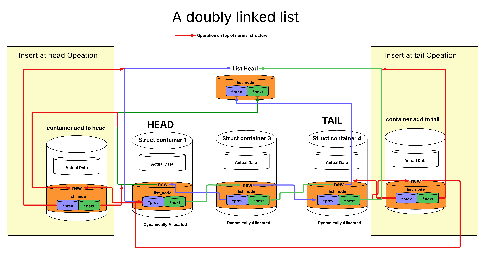

# Memory Management
The generic memory has following modules
* List : generic doubly link list to maintain 
	 all the thread list, device list interrupt list etc

## Link List to generic list_node structure

